# Note Taker Application


## Description

- This note taking application will allow a user to create and store notes with
  a title and body. The application stores the information in a database so
  information an be stored over a period of time, so the user can keep notes for
  a longer period of time.
- The technology used for this application are: node, javascript, express (npm),
  file structure (node), path (node) bootstrap styling, fontawesome (html
  images)
- The biggest challenge I had understanding how to handle static files within
  express. Once I found the required use, everything else seemed to work pretty
  easily.

## Table of Contents

- [Installation](#installation)
- [Usage](#usage)
- [License](#license)
- [Contributing](#contributing)
- [Demo](#demo)
- [Questions](#questions)

## Installation

To install necessary dependencies, run the following command:

```
npm i
```

The following dependencies will be installed:

- express

## Usage

A user will go to the
[website](https://brownnicholasj-note-taker.herokuapp.com/) and click on the
'Get Started' button. 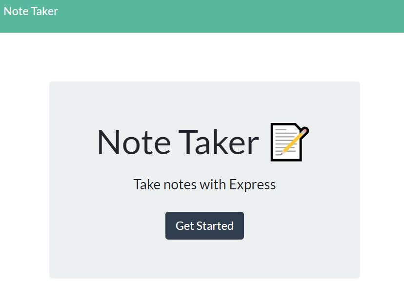

The user will then be presented with stored notes on the left side and the
ability to add new notes with a Title and Body section.
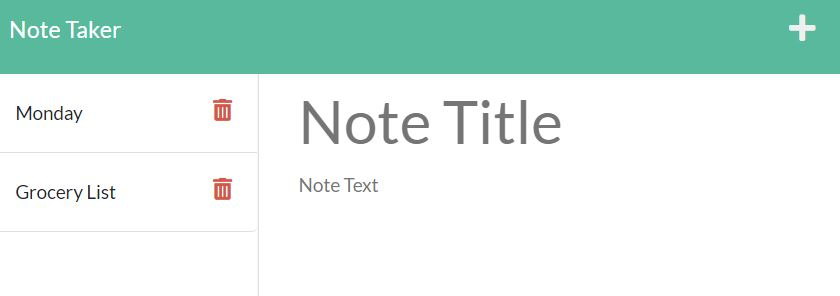

When the user enters a note title and note text, then a save button will appear
in the top right. 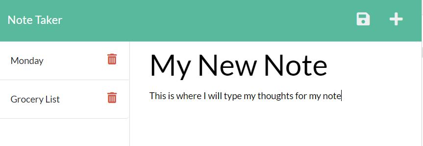

When the user clicks the save button, the note will be stored in the database
and visible on the stored list to the left side of the screen.
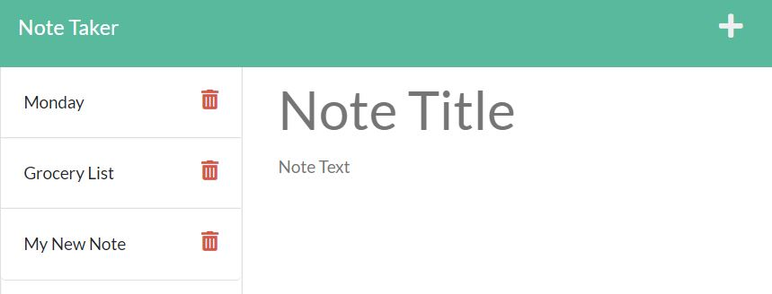

When a user wants to view the details of a stored note, they can click on the
note title on the left side. A read only view of the note title and text will be
visible in the main section of the page
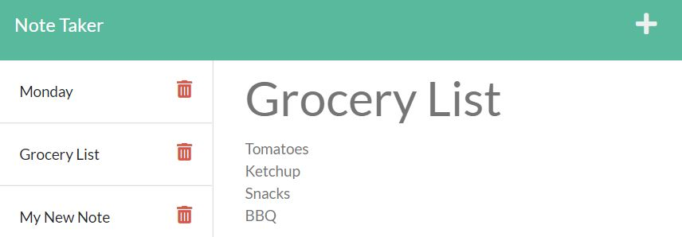

When a user wants to add a new note when they have a previous note pulled up (in
read only view), the user can click the '+' icon in the top right and the main
section will clear and be eligible for a user to create a title and text
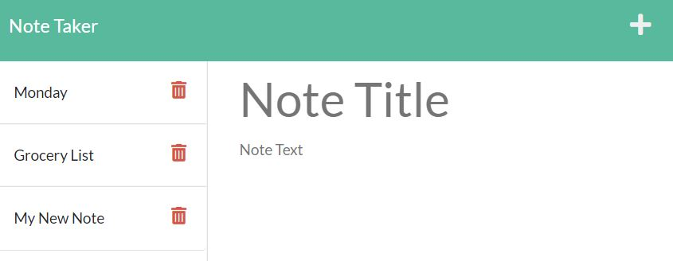

WHen a user wants to delete a note, they can press the red trashcan icon on the
list to the left and the note will be deleted from the database and from the
list 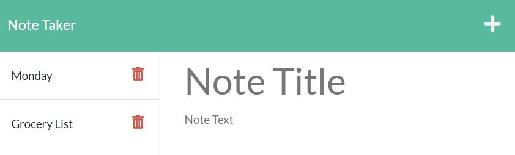

## License

This project is licensed under the MIT license.

## Contributing

A thanks to the following contributors to this project:

- 2021 Trilogy Education Services, LLC
- Nicholas Brown (brownnicholasj.dev@gmail.com)

## Demo

Click the following link to watch video demo of the application (43sec
runtime)<br> https://youtu.be/wBTsdZ2h9fg

### Behind the Code

- The GET request for /notes will return the user the notes.html and all other
  requests to the index.html <br> 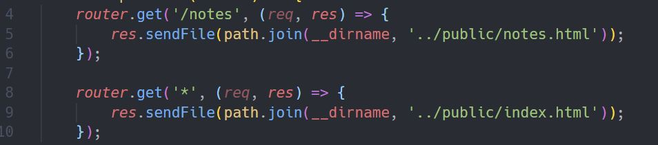

- The GET and POST requests for api/notes will return the database and allow
  notes to be saved to the db: <br> 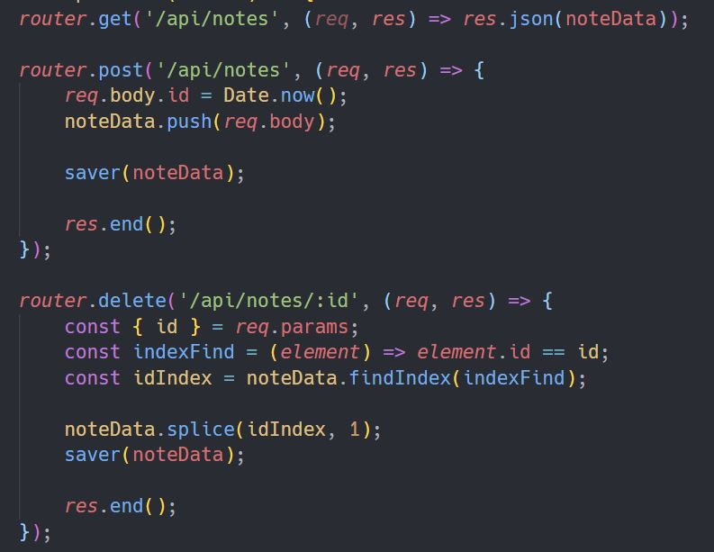

  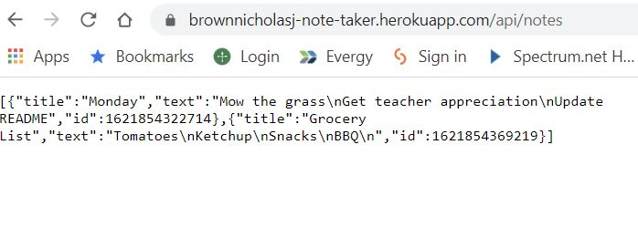

- The saver function within the code is called when a POST or DELETE request
  comes in and posts (or deletes) the data to the db.json file
  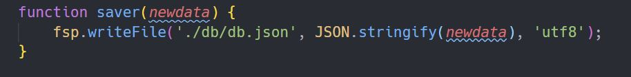

- The unique identifier is determined by utilizing the date function within
  Javascript. This will establish a UNIX formatted date as the unique ID, since
  it inherently counts up with milliseconds, it will serve well as a unique ID
  creator 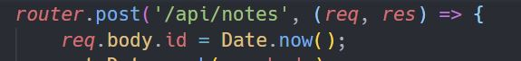

  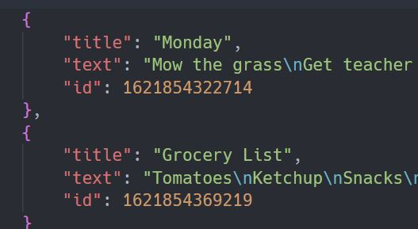

## Questions

If you have any questions about the repo, open an issue or contact me directly
at brownnicholasj.dev@gmail.com.You can find more of my work at
[brownnicholasj](https://github.com/brownnicholasj/).
